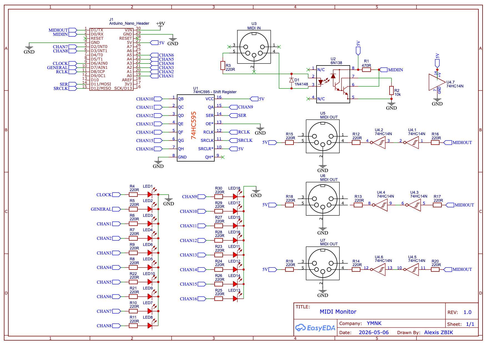

# MIDI Monitor (Arduino)

Real-time MIDI monitor for Arduino.
Reads incoming MIDI messages on the hardware UART, drives per-channel LEDs, and shows global/clock activity.
Works as a MIDI thru device: everything received at the input is forwarded to the output.
Compatible with Arduino Uno and Nano.  
Not compatible with Nano Every as-is (use `Serial1` for that board).

## Features

- Global MIDI activity indicator.
- Transport clock indicator (`Start`, `Stop`, `Clock`).
- Per-channel indicators.
- MIDI thru enabled.

## Quick Configuration

- Blink duration: `blinkTime` in `BaseBlinker.h` (default `5` ms).
- Pins are defined at the top of `midi-monitor.ino`:
  - Channels 1-8 and clock/general each use a dedicated pin.
  - Channels 9-16 use a shift register.

## Schematic

